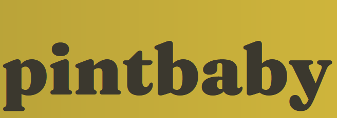

Welcome to my interactive front-end development milestone project. For this project I chose to create 
[pintbaby](https://www.pintbaby.herokuapp.com/), a website that allows users to add and review pubs around the world.

## User Experience

### Styling

- A [Balsamiq](https://www.balsamiq.com/) wireframe for this project is included in the repository, with 
[desktop/tablet](planning/wireframes/#.pdf) and [mobile](planning/wireframes/#.pdf) versions.

I used the following hex colours, selected using [Pixlr](https://www.pixlr.com/). Most of the colours were originally 
based on photographs contained with the [Snug Project](https://thesnugproject.com/) calendar, and then tweaked to best 
suit a website:

 - #4A463A and #443E32 are medium browns >>>;
 - #3B382E is a dark brown used as a replacement for any blacks used in stylised text against coloured backgrounds to 
 give a slightly warmer feel;
 - #CBBF85 is a cream >>>;
 - #885043 is a deep, faded red >>>;
 - #CFB53B is a officially called [old gold](https://en.wikipedia.org/wiki/Old_gold), and I have been wanting to use this
 for some time as it is that used in the home jerseys of [Wolverhampton Wanderers FC](https://www.wolves.co.uk/).

- Fonts
    - [Spectral](https://fonts.google.com/specimen/Spectral) is a serif font with plenty of space and clarity. I wanted 
    to utilise serifs mainly for the vintage, old-fashioned feel they give, like the best Irish pubs. This font is used 
    for the majority of text within the project outside of headings.  
    - After listening to plenty of [Pet Sounds](https://en.wikipedia.org/wiki/Pet_Sounds) during the early stages of the
    project, I wanted to use the iconic [Cooper Black](https://en.wikipedia.org/wiki/Cooper_Black) that features on that 
    record. It is a proprietary font, so [Fraunces](https://fonts.google.com/specimen/Fraunces) was a great replacement. 
    Again, it is definitely a vintage font, in keeping with the idea that so many great pubs and bars in the world have a 
    time-worn, lived-in, nostalgic feel.

- The icons I used within this project are all sources from [Font Awesome](https://fontawesome.com/)'s free package.

### User Stories

Testing for each of the below user stories is included within the [testing log](TESTING.md).

As a user I want to...

  1. ... read about a pub I have not visited before;
  2. ... rate a pub that I have just visited;
  3. ... find the best-rated pub in a city I am visiting;
  4. ... see my review history
  5. ... edit or amend a review I previously wrote;

As an admin, I want to
  1. ... delete a malicious or offensive review;
  2. ... search a for a user using a particular criteria;
  3. ... >>>.

## Features

### Existing Features

- Rate a pub's price point and the quality of the pint served
- Search by name, city, country
- 

### Features to Implement

- Share plans with friends - This is the key to any website at the moment. I signed up to ShareThis during my previous 
project with a view to adding some pre-made share buttons to the site, but was getting quite a lot of console warnings a
bout non-loadable content, so this feature has been omitted from the first release.
- 
- 
- 
- 

## Technologies Used

- [HTML5](https://en.wikipedia.org/wiki/HTML5)
    - HTML is the language used to display and structure information on any website.

- [CSS3](https://en.wikipedia.org/wiki/CSS3)
    - Cascading Style Sheets is the language used to style HTML content.

- [Materialize](https://materializecss.com/)
    - Materialize's grid framework helped me bring my initial wireframe ideas to life.

- [Javascript](https://www.javascript.com/)
    - The language that makes the web interactive.

- [jQuery](https://jquery.com/)
    - An open-source Javascript library that simplifies interactive web design. In this case it is the key to utilising
    some of Materialize's key features.

- [Font Awesome](https://fontawesome.com/)
    - Font Awesome's free package provides a comprehensive icon suite that is fully customisable in CSS.
    
- [Google Fonts](https://fonts.google.com/)
    - Google's free service provided countless fonts to help your project stand out.

- [Gitpod](https://www.gitpod.io/)
    - A software development editor perfect for personal or collaborative use.

- [GitHub](https://www.github.com/)
    - The world's leading code-hosting platform, and the location of the core code that the project is built upon.

- [Heroku](https://www.heroku.com/)
    - >>>

- [EmailJS](https://www.emailjs.com/)
    - Client-side Javascript software that I used to create the this project's contact form.

- [Balsamiq](https://www.balsamiq.com/)
    - An intuitive drafting tool that enables visual planning at the start of a project. As my projects grow larger, I 
    am increasingly leaning on Balsamiq as a way of whittling down a few sketches into a solid project plan.

- [Pixlr](https://www.pixlr.com/)
    - Pixlr is a great free software package that enabled me to quickly pick out hex colors and edit images. I have been
    using this for all sorts of things for about five years and it is somehow still free-to-use.

- [Favicon.io](https://favicon.io/)
    - A quick and easy tool to create favicons for display in the address bar.

- [MongoDB](https://www.mongodb.com)
    - A non-relational database in which all data submitted by users is stored, and also where the skeleton of the project's
    data structure was first mapped out.

## Testing

I have included a [testing log](TESTING.md) within the repository.

>>> In terms of look and feel, the site is similar across all browsers. The tablet and desktop views are almost identical, 
while mobile devices always drop into col-12 formatting. The mobile and tablet views both place buttons underneath a map 
that stretches to  fill the screen width. For mobile devices, I have included Materialize's default sidenav bar, which was 
much easier to set up than Bootstrap's mobile menu options.

I tested this project primarily on Firefox but also Chrome and Edge, taking advantage of the screen size options to test 
using iPad, Samsung Galaxy and Kindle Fire. I also tested the site on my own Huawei device, as well as passing the initial 
site on to some friends for UI feedback and some rudimentary data entry testing.

## Deployment

I used [GitHub](https://www.github.com/) as the code host for this project, and [GitPod](https://www.gitpod.io/) to write 
it, using just a single branch. <<<stuff about [Heroku](https://www.heroku.com/) and >>>. The actual data is stored within 
a [MongoDB](https://www.mongodb.com/) cluster >>>.

I deployed this project to Heroku using the following method:

1. >>>;
2. >>>;
3. >>>.

I set up the data structure for this project in MongoDB using the following method:

1. >>>;
2. >>>;
3. >>>.

### Cloning

Assuming you already have Git [installed](https://git-scm.com/download/), anybody can clone this repository by following 
these steps:

- Open the command prompt/terminal on your machine;
- Type the command 'cd' followed by the directory you wish to store the repository in;
- Go to the top of the [GitHub repository](https://github.com/kiehozero/pintbaby/) and click the green 'Code' drop-down 
button;
- Copy the [link provided](https://github.com/kiehozero/pintbaby.git);
- Return to the Command Prompt and type 'git clone' followed by the copied address.

For an in-depth guide to cloning repositories, click 
[here](https://www.howtogeek.com/451360/how-to-clone-a-github-repository/), from which the steps above were taken.

<<<Heroku and Mongo cloning information?>>>

## Credits

### Content

- In previous projects I have spent a lot of time trying to untangle my own CSS from Bootstrap; in this project I 
committed myself to using as much content from a pre-built CSS library as I could. The 
[Materialize](https://materializecss.com/) is a really lightweight and powerful library that provided great results 
out of the box. The result of this is that nearly all of my CSS styling was around colouring and font selection.
- The [HTML5 Pattern](https://www.html5pattern.com/Miscs) website is a great resource for understanding the use and
format of regular expressions in validating user-inputted text.
- W3 as usual
- Pymongo docs
- Flask Pymongo docs

### Tutorials

- [Code Institute](https://www.codeinstitute.net/)'s task manager project gave me a good structure to work from, 
as well as the foundations for my Python interaction with MongoDB.
- To create a list of countries that users can select from I used a 
[CodevsColor](https://www.codevscolor.com/insert-multiple-documents-mongodb-collection) guide on the MongoDB shell's
insertMany function, then used data I found from a HTML element was created by GitHub user 
[DanRovito](https://gist.github.com/DanRovito/977bcb97c9c2dfd3398a). There is also official 
[pyMongo documentation](https://pymongo.readthedocs.io/en/stable/api/pymongo/collection.html#insert_many) on this
function.
-

### Media

- I found the background image for the landing page on the 
[Rebel Dublin](http://rebeldublin.ie/life-in-dublin/nightlife/dublin-pub-crawl-camden-mile/) website, but the photograph 
was originally taken by the writers of the [My Name is Ola](http://www.mynameisola.com/en) blog.

### Acknowledgements

- >>>
- >>>