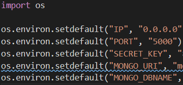

Welcome to my data-centric development milestone project. For this project I chose to create 
[pintbaby](https://www.pintbaby.herokuapp.com/), a website that allows users to add and review pubs around the world.

## User Experience

### Styling

- A [Balsamiq](https://www.balsamiq.com/) wireframe for this project is included in the repository, with 
[desktop/tablet](planning/wireframes/desktop.pdf) and [mobile](planning/wireframes/mobile.pdf) versions.

I used the following hex colours, selected using [Pixlr](https://www.pixlr.com/). Most of the colours were originally 
based on photographs contained with the [Snug Project](https://thesnugproject.com/) calendar, and then tweaked to best 
suit a website:

 - #4A463A and #443E32 are medium browns used on icons;
 - #3B382E is a dark brown used as a replacement for any blacks used in stylised text against coloured backgrounds to 
 give a slightly warmer feel;
 - #CBBF85 is a cream used as the background on some smaller elements;
 - #C34040 is a red that I've used on buttons to delete and remove items;
 - #CFB53B is a officially called [old gold](https://en.wikipedia.org/wiki/Old_gold) and is the main colour for focussed and
 active elements. I have been wanting to use this for some time as it is the traditional colour used in the home jerseys of 
 [Wolverhampton Wanderers](https://www.wolves.co.uk/).

### Fonts and Icons

[Spectral](https://fonts.google.com/specimen/Spectral) is a serif font with plenty of space and clarity. I wanted to utilise 
serifs mainly for the vintage, old-fashioned feel they give, like the best Irish pubs. This font is used  for the majority 
of text within the project outside of headings.

After listening to plenty of [Pet Sounds](https://en.wikipedia.org/wiki/Pet_Sounds) during the early stages of the project, 
I wanted to use the iconic [Cooper Black](https://en.wikipedia.org/wiki/Cooper_Black) that features on that record. It is 
a proprietary font, so [Fraunces](https://fonts.google.com/specimen/Fraunces) was a great replacement. Again, it is 
definitely a vintage font, in keeping with the idea that so many great pubs and bars in the world have a time-worn, 
lived-in, nostalgic feel.

The icons I used within this project are all sources from [Font Awesome](https://fontawesome.com/)'s free package.

I overwrote the Materialize styling of the cards to increase the border-radius, I wanted each review to resemble the 
shape of cardboard beer mats, especially the 
[collectible beer mats](https://cartophilic-info-exch.blogspot.com/2015/11/fosters-lager-scottish-courage-sporting_14.html)
that used to be found in pubs.

### Responsiveness

In terms of look and feel, the site is similar across all browsers. The tablet and desktop views are almost identical
but for a few alignment changes, while mobile devices always drop into col-12 formatting. For mobile devices, I have 
included Materialize's default sidenav bar, which was much easier to set up than Bootstrap's mobile menu options. I have 
also tended to use jQuery to change descriptive buttons it icon-based buttons for smaller devices. A full responsiveness
testing procedure can be found within the [testing log](planning/testing/TESTING.md).

### User Stories

Testing for each of the below user stories is included within the [testing log](planning/testing/TESTING.md).

As a user I want to...

  1. ... read about a pub I have not visited before;
  2. ... rate a pub that I have just visited;
  3. ... add a pub that is not yet on the site.
  4. ... find pubs in a city I am visiting;
  5. ... see my review history;
  6. ... edit a review I previously wrote;
  7. ... edit my profile information.

As an admin, I want to
  1. ... delete or moderate an offensive review;
  2. ... view a user's review history;
  3. ... delete a pub;
  4. ... delete a malicious user;

## Features

### Existing Features

- All users can access all pubs and reviews upon arrival at the site without registering by visiting the Pubs page. Users 
without an account cannot edit or add any reviews.
- Upon registering, account holders can, in addition to the above, add a pub by visiting the Pub page, as well as adding a review
either by visiting the Add a Review page or visiting the page of a pub they wish to review. If they visit the former page and 
cannot find their pub, a link at the top of the page directs them to the Add a Pub page.
- When adding a review, all fields are mandatory. All ratings and dates are restricted by Materialize drop-downs and pickers, 
while the price field is restricted to numbers, whether whole or decimal. The review field itself is restricted to 400 characters,
but must be greater than 400 characters.
- When adding a pub, all fields except County and photo are mandatory. If no photograph is submitted, a placeholder image is used. 
The country field is controlled by a drop-down list, and the URL field must meet the criteria of the HTML input form URL type.
- The pubs page by default shows all pubs in the database. A search bar allows users to filter by pub name, city or country, and 
then to switch the filter off to display all entries again.
- Admin features: admins can edit and delete any review or pub within a pub's page. Admins cannot access or edit a user's forename, 
surname or password using the admin panel, but they can view a list of each user's complete review history from the Users page, 
as well as deleting the user's account here.

### Features to Implement

- User profile photos - The registration page asks for very little information from the user. I wanted to expand this in the 
Edit Profile section to allow users to upload a photo. Since I had used the URL option already on the Add Pub section, it 
seemed like asking the user to leave the website a second time might tempt some users to leave altogether. Once I get to grip
with allowing users to upload documents and files from devices, and the storage of these within a datbase, this feature will 
be implemented.
- Review aggregation - most pubs only have one or two reviews, but it would be great for users to see those scores aggregated
if they want a quick idea of what a pub is like, rather than just seeing everybody's scores. I looked into how to do this but
it was beyond my current Python skills!
- As the database expands I would like to include more filters on the pubs page and allow users to custom sort reviews by what
they find most important, whether it is price, atmosphere or overall rating.
- Ìntegration of Google Image Search API - My initial project plan had this in as an optional extra. After recalling the
amount of time I spent on my second milestone project wrestling with the Maps API, it seemed unwise to sacrifice potential
testing and validation time to include this feature.
- Integration of Google Maps API - As above, it seemed unwise to sacrifice time ensuring that my Python and Flask work was 
up to standard for the sake of adding a small location map to each pub's entry.
- Change password feature - In the Edit Profile section I have used the $set command to allow users to edit their information
but not their password. I did quite a bit of background reading on Werkzeug and could not manage to securely retrieve, edit 
and upload a new hashed password so I've left this out of version one.
- Drink selection - The initial draft of this project had a drop-down field for each user to select the drink they
purchased during the visit. I couldn't find an easy way allowing users to add a new drink into the database, and sticking
with just the few that I had added in meant potentially constraining user reviews so I took the feature out for now. 

## Technologies Used

- [HTML5](https://en.wikipedia.org/wiki/HTML5)
    - HTML is the language used to display and structure information on any website.

- [CSS3](https://en.wikipedia.org/wiki/CSS3)
    - Cascading Style Sheets is the language used to style HTML content.

- [Materialize](https://materializecss.com/)
    - Materialize's grid framework helped me bring my initial wireframe ideas to life.

- [Javascript](https://www.javascript.com/)
    - The language that makes the web interactive.

- [jQuery](https://jquery.com/)
    - An open-source Javascript library that simplifies interactive web design. In this case it is the key to utilising
    some of Materialize's key features.

- [Font Awesome](https://fontawesome.com/)
    - Font Awesome's free package provides a comprehensive icon suite that is fully customisable in CSS.
    
- [Google Fonts](https://fonts.google.com/)
    - Google's free service provided countless fonts to help your project stand out.

- [Gitpod](https://www.gitpod.io/)
    - A software development editor perfect for personal or collaborative use.

- [GitHub](https://www.github.com/)
    - The world's leading code-hosting platform, and the location of the core code that the project is built upon.

- [Heroku](https://www.heroku.com/)
    - A cloud platform for hosting scaleable apps in a variety of programming languages.

- [EmailJS](https://www.emailjs.com/)
    - Client-side Javascript software that I used to create the this project's contact form.

- [Balsamiq](https://www.balsamiq.com/)
    - An intuitive drafting tool that enables visual planning at the start of a project. As my projects grow larger, I 
    am increasingly leaning on Balsamiq as a way of whittling down a few sketches into a solid project plan.

- [Pixlr](https://www.pixlr.com/)
    - Pixlr is a great free software package that enabled me to quickly pick out hex colors and edit images. I have been
    using this for all sorts of things for about five years and it is somehow still free-to-use.

- [Favicon.io](https://favicon.io/)
    - A quick and easy tool to create favicons for display in the address bar.

- [MongoDB](https://www.mongodb.com)
    - A non-relational database in which all data submitted by users is stored, and also where the skeleton of the project's
    data structure was first mapped out.

- [Flask](https://flask.palletsprojects.com/)
    - Flask is a Python framework that can be set up very quickly and is very flexible.

## Testing

I have included a [testing log](planning/testing/TESTING.md) within the repository.

I tested this project primarily on Firefox but also Chrome and Edge, taking advantage of the screen size options to test 
using iPad, Samsung Galaxy and Kindle Fire. I also tested the site on my own Huawei device, as well as passing the initial 
site on to some friends for UI feedback and some rudimentary data entry testing.

## Deployment

I used [GitHub](https://www.github.com/) as the code host for this project, and [GitPod](https://www.gitpod.io/) to write 
it, using just a single branch. stuff about [Heroku](https://www.heroku.com/). The actual data is stored within 
a [MongoDB](https://www.mongodb.com/) cluster, and four sub-collections (see the Data Architecture section below).

### Cloning the GitHub repository

Assuming you already have Git [installed](https://git-scm.com/download/), anybody can clone this repository by following 
these steps:

- Open the command prompt/terminal on your machine;
- Type the command 'cd' followed by the directory you wish to store the repository in;
- Go to the top of the [GitHub repository](https://github.com/kiehozero/pintbaby/) and click the green 'Code' drop-down 
button;
- Copy the [link provided](https://github.com/kiehozero/pintbaby.git);
- Return to the Command Prompt and type 'git clone' followed by the copied address.

For an in-depth guide to cloning repositories, click 
[here](https://www.howtogeek.com/451360/how-to-clone-a-github-repository/), from which the steps above were taken.

### MongoDB

I set up the data structure for this project in MongoDB using the following method:

1. After creating an account at [MongoDB](https://cloud.mongodb.com/), create a new cluster;
2. In the Cluster sandbox, navigate to the Collections item;
3. Click the Create Database and choose a name, as well the name of your first Collection;
4. Hover over the Collection name and create three additional Collections by clicking the green plus icon;
5. The exact names and fields of each database have been highlighted in the Database Architecture section below;
6. Back in your Gitpod terminal, create both an env.py and a .gitignore file;
7. The .gitignore file is a list of files that will not be uploaded to GitHub, it is VERY important that you add
your env.py file to .gitignore before you stage any commits;
8. Within the env.py file you will need to add the variables that Gitpod will use to connect to MongoDB, the 
secret key and the URI name are both obtained from your MongoDB cluster settings under the Connect button, it is
VERY important that you do not publish these anywhere or commit them to a public setting:

9. Finally, run your app using the command 'python3 app.py'. Once you have done this you can move onto the Heroku
instructions outlined below.

### Heroku

I deployed this project to Heroku using the following method:

1. After setting up a [Heroku](https://www.heroku.com/) account and creating a new app, head back to your terminal
and set up a requirements.txt file that automatically updates when you import a library. Instead of using the 
regular 'touch' command, enter 'pip3 freeze -- local > requirements.txt' into the terminal and press enter;
2. Run the 'python app.py > Procfile' command to create a file that Heroku will use to run your app automatically, 
as opposed to you using the python3 app.py command each time you open Gitpod;
3. Push both the Procfile and requirements.txt to your repository;
4. In the Heroku app settings, click the Connect to GitHub button and select the repository you wish for Heroku to
connect to. Click the Config Variables button and select the Reveal option, and enter the items that were added to
your env.py file line-by-line. Since you added it to .gitignore, Heroku will not be able to see it in the GitHub
repository.
5. Once the connection is confirmed, scroll down to the bottom and click the Enable Automatic Deployment button.
6. After a couple of minutes select the Open App button, and you will now have a hosted URL for the project. Unlike
Gitpod or any other IDE, this app will only update when you push changes to your repository.

### Python Libraries

This project is built on the [Flask](https://flask.palletsprojects.com/) framework, as well as importing the 
Flask-PyMongo library and Werkzeug library for ensuring password security.

## Database Architecture

As mentioned above, the database is built in MongoDB, and a sketch of the database's archtecture can be found
below. The database is built on four collections and all field are stored in the default string format:

- The first database a user will contribute to is the User collection. This collects a username, first name, last
name and password from the user upon registration.
- The second database is the Pubs collection. This takes a name, street, city, county, country and photo URL from
the user when they add a new pub, although the county and URL fields are optional.
- A third database that exists solely to feed the Pubs collection is Countries. I've documented how this was built
in the credits selection, but it serves as a drop-down menu in the Pub creation userform.
- The Pubs and Users collections both help the user populate the review form, which posts to the Reviews collection
a review author (passed from the user's username), a visit date (in yyyy-mm-dd format), three ratings (integer 
format via drop-down menus), a drink price (validated insde the HTML element to provide a decimal number to a 
maximum of two places that is greater than 0), and finally a text-based review.
- The various admin pages and search function are created by matching and finding various combinations of usernames, 
pub names and MongoDB document ids and returning the relevant data.

## Credits

### Content

- In previous projects I have spent a lot of time trying to untangle my own CSS from Bootstrap; in this project I 
committed myself to using as much content from a pre-built CSS library as I could. The 
[Materialize](https://materializecss.com/) is a really lightweight and powerful library that provided great results 
out of the box. The result of this is that nearly all of my CSS styling was around colouring and font selection. I 
also used plenty of their pre-built templates to get up and running quickly, especially the form, button, card and modal
templates.
- The [HTML5 Pattern](https://www.html5pattern.com/Miscs) website is a great resource for understanding the use and
format of regular expressions in validating user-inputted text;
- [W3 Schools](https://www.w3schools.com/python/python_mongodb_getstarted.asp) helpfully contains a quick start 
guide for Pymongo;
- [PyPi Flask PyMongo documentation](https://pypi.org/project/Flask-PyMongo/);
- [W3Schools](https://www.w3schools.com/tags/att_input_min.asp) input entries helped me resolve some basic validation 
issues that my mentor identified. See bugfix #11 in the [testing log](planning/testing/TESTING.md);

### Tutorials

- [Code Institute](https://www.codeinstitute.net/)'s task manager project gave me a good structure to work from, 
as well as the foundations for my Python interaction with MongoDB;
- To create a list of countries that users can select from I used a 
[CodevsColor](https://www.codevscolor.com/insert-multiple-documents-mongodb-collection) guide on the MongoDB shell's
insertMany function, then used data I found from a HTML element was created by GitHub user 
[DanRovito](https://gist.github.com/DanRovito/977bcb97c9c2dfd3398a). There is also official 
[pyMongo documentation](https://pymongo.readthedocs.io/en/stable/api/pymongo/collection.html#insert_many) on this
function;
- [Pythonise](https://pythonise.com/series/learning-flask/flask-message-flashing) and 
[AskPython](https://www.askpython.com/python-modules/flask/flask-flash-method)'s lessons on flash messaging helped 
me understand a pretty basic part of Flask, but nevertheless a very important one;
- [Dakila Lozano](https://codepen.io/dakila/pen/GxbxGB) demonstrated how to manipulate the maxDate option in 
Materialize's [datepicker](https://materializecss.com/pickers.html), and a quick check of 
[W3Schools](https://www.w3schools.com/js/js_date_methods.asp) allowed for a quick resolution;
- The good people over at [Useful Angle](https://usefulangle.com/post/36/javascript-validate-url-form-input-field-without-regex)
provided a quick solution for adding URLs using HTML's form element;
- [Tutorial Deep](https://tutorialdeep.com/knowhow/open-bootstrap-modal-on-button-click-jquery/) provided a quick guide to using 
jQuery in contact forms;
- [RegExOne](https://regexone.com/lesson/repeating_characters) helped me sort out some validation issues that were highlighted in my
first mentor review;
- [Pythonise] has a great tutorial series on using Flask, particularly the link on how to best utilise 
[flash messaging](https://pythonise.com/series/learning-flask/flask-message-flashing), and also the 
[error handling](https://pythonise.com/series/learning-flask/flask-error-handling) lesson.

### Media

- I found the background image of Against the Grain for the landing page on the 
[Rebel Dublin](http://rebeldublin.ie/life-in-dublin/nightlife/dublin-pub-crawl-camden-mile/) website, but the photograph 
was originally taken by the writers of the [My Name is Ola](http://www.mynameisola.com/en) blog.
- The Black Horse [photo](https://www.robinsonsbrewery.com/pubs/black-horse-preston/) on the landing page is courtesy of 
Robinson's Brewery.
- The Long Hall [photo](https://suitcasemag.com/articles/best-pubs-dublin) on the landing page is courtesy of Suitcase.
- The photos I uploaded when creating new pubs were all sourced from [Google Maps](https://maps.google.com/).

### Acknowledgements

- My brother Adam for doing some testing, along with work colleagues Andy, Brendan, the two Davids and Odhran, my partner for 
letting me eternally bounce ideas of myself and my mentor Precious for helping me structure and prioritise my project work.